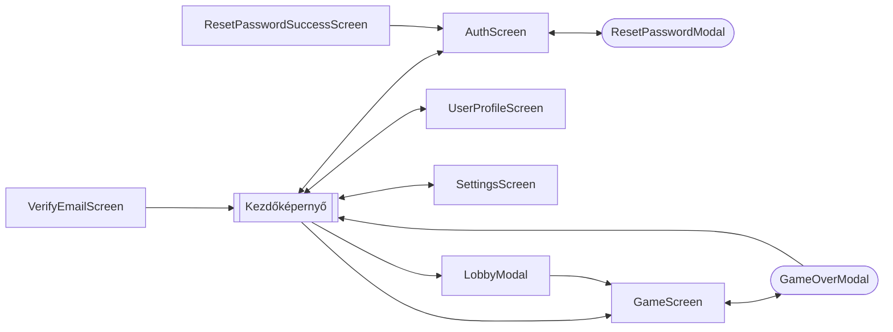

# Funkcionális specifikáció
## A rendszer célja
- Az eredeti Infinity-Simon játék továbbfejlesztése egy többjátékos, versengő játékmóddal.
- A játékosok pontszámainak szerveren történő tárolása és elérhetősége bármilyen eszközről.
- Részletes statisztikák és elemzések biztosítása a játékosok teljesítményéről.
- Különböző játékmódok bevezetése a változatos játékélmény érdekében.
- Jelenlegi egyjátékos mód megtartása.

**A rendszernek nem célja**:
- Közösségi funkciók, mint például chat vagy barátlista.
- Hirdetések vagy fizetős tartalmak bevezetése.
- Többplatformos támogatás, a rendszer kizárólag webes környezetben működik.

## Használati esetek

### EPIK: Infinite-Simon webalkalmazás fejlesztése
#### FEATURE: Egyjátékos mód fejlesztése
Mint játékos, szeretném játszani az egyjátékos módot, hogy teszteljem a memóriámat és javítsam a rekordjaimat.

**Background:** **Given** A felhasználó megnyitotta az Infinite-Simon webalkalmazást

##### SCENARIO: Játék indítása egyjátékos módban
**When** A felhasználó elindítja az egyjátékos módot 
**Then** A játék elindul, és a felhasználó látja az első mintát 

##### SCENARIO: Játék folyamata egyjátékos módban
**Given** A játék elindult egyjátékos módban 
**When** A felhasználó helyesen követi a mintát 
**Then** A játék újabb, hosszabb mintát mutat

##### SCENARIO: Játék vége egyjátékos módban
**Given** A felhasználó hibázik a mintakövetés során 
**When** A játék véget ér 
**Then** A felhasználó látja az elért körszámot, és az eredmény elmentésre kerül

#### FEATURE: Felhasználói hitelesítés és regisztráció
Mint új felhasználó, szeretnék regisztrálni és bejelentkezni az alkalmazásba, hogy elmenthessem a játékom eredményeit és statisztikáimat.

**Background:** **Given** A felhasználó megnyitotta az Infinite-Simon webalkalmazást

##### SCENARIO: Felhasználó regisztrációja
**When** A felhasználó kitölti a regisztrációs űrlapot és elküldi azt 
**Then** A felhasználó fiókja létrejön, és bejelentkezik az alkalmazásba

##### SCENARIO: Felhasználó bejelentkezése
**Given** A felhasználó rendelkezik érvényes fiókkal 
**When** A felhasználó megadja a hitelesítési adatait és bejelentkezik 
**Then** A felhasználó sikeresen bejelentkezik az alkalmazásba

##### SCENARIO: Jelszó visszaállítása
**Given** A felhasználó elfelejtette a jelszavát 
**When** A felhasználó kéri a jelszó visszaállítását 
**Then** A felhasználó kap egy emailt a jelszó visszaállítási linkkel

##### SCENARIO: Fiók aktiválása email-ben küldött link segítségével
**Given** A felhasználó regisztrált egy új fiókot 
**When** A felhasználó rákattint az email-ben kapott aktivációs linkre 
**Then** A felhasználó fiókja aktiválódik

#### FEATURE: Felhasználói profil és statisztikák megjelenítése
Mint regisztrált felhasználó, szeretném megtekinteni a profilomat és a játékom statisztikáit, hogy nyomon követhessem a fejlődésemet.

**Background:** **Given** A felhasználó be van jelentkezve az Infinite-Simon webalkalmazásba

##### SCENARIO: Profil megtekintése
**When** A felhasználó navigál a profil oldalára 
**Then** A felhasználó látja a profil adatait és a játékmenet statisztikáit

##### SCENARIO: Statisztikák elemzése
**Given** A felhasználó a profil oldalán van 
**When** A felhasználó megtekinti a részletes statisztikákat 
**Then** A felhasználó látja az átlagos körszámokat, legjobb eredményeket és a játékai történetét

#### FEATURE: Többjátékos mód fejlesztése
Mint játékos, szeretnék többjátékos módban játszani más játékosok ellen, hogy versenyezhessek és javíthassam a készségeimet.

**Background:** 
**Given** A felhasználó be van jelentkezve az Infinite-Simon webalkalmazásba

##### SCENARIO: Lobby létrehozása többjátékos módhoz
**When** A felhasználó létrehoz egy új többjátékos játék lobby-t 
**Then** A lobby létrejön, a felhasználó kap egy egyedi kódot amellyel mások csatlakozhatnak

##### SCENARIO: Csatlakozás egy meglévő többjátékos lobby-hoz
**Given** A felhasználó rendelkezik egy érvényes lobby kóddal 
**When** A felhasználó megadja a lobby kódot és csatlakozik 
**Then** A felhasználó sikeresen csatlakozik a többjátékos játékhoz

<!-- TODO update -->
##### SCENARIO: Játék indítása többjátékos módban
**When** A belépő játékos elindítja a többjátékos játékot 
**Then** A játék elindul, és a felhasználó ugyanazt a minta sorozatot fogja látni, mint a többi játékos

#### FEATURE: Különböző játékmód (alap, kibővített)
Mint játékos, szeretnék különböző játékmódok közül választani (alap és kibővített), hogy változatosabb játékélményt kapjak.

**Background:** **Given** A felhasználó be van jelentkezve az Infinite-Simon webalkalmazásba

##### SCENARIO: Játékmód kiválasztása
**When** A felhasználó kiválasztja a kívánt játékmódot a főképernyőn 
**Then** A játék a kiválasztott játékmódban indul el

##### SCENARIO: Játék menete különböző játékmódokban
**Given** A játék elindult a kiválasztott játékmódban 
**When** A felhasználó játszik a játékkal 
**Then** A játék a kiválasztott játékmód szabályai szerint működik

#### FEATURE: Profil beállítások és testreszabás
Mint felhasználó, szeretném testreszabni a profilomat és beállításaimat, hogy személyre szabottabb élményt kapjak.

**Background:** **Given** A felhasználó be van jelentkezve az Infinite-Simon webalkalmazásba

##### SCENARIO: Profil beállítások módosítása
**When** A felhasználó navigál a profil beállítások oldalára és módosítja az adatokat 
**Then** A módosítások elmentésre kerülnek, és a profil frissül

#### FEATURE: Játékbeállítások
Mint felhasználó, szeretném testreszabni a játékbeállításokat, hogy a saját preferenciáim szerint játszhassak.

**Background:** **Given** A felhasználó megnyitotta az Infinite-Simon webalkalmazást

##### SCENARIO: Játékbeállítások módosítása
**When** A felhasználó navigál a játékbeállítások oldalára és módosítja a beállításokat 
**Then** A módosítások elmentésre kerülnek, és a játék a frissített beállításokkal indul el

## Határ osztályok
| Határ osztály | Leírás |
|---------------|--------|
| App | A fő alkalmazás osztály, amely kezeli a képernyők közötti navigációt. |
| AuthScreen | A felhasználói bejelentkezést és regisztrációt kezeli. |
| UserContext | A felhasználói állapot és adatok kezeléséért felelős osztály. |
| MainScreen | A kezdőképernyő, ahol a játékos navigálhat a különböző funkciók között. |
| LobbyModal | A többjátékos játékokhoz való csatlakozást és várakozást kezeli. |
| SettingsScreen | A játék és alkalmazás beállításainak módosítását teszi lehetővé. |
| UserProfileScreen | A felhasználói profil megtekintését és szerkesztését teszi lehetővé, valamint a felhasználói statisztikák megjelenítését. |
| GameScreen | A játék fő képernyője, ahol a játékos játszik |
| GameOverModal | A játék vége képernyő, ahol a játékos megtekintheti az eredményét és a pontszáma elmentésre kerül. |
| ResetPasswordModal | A jelszó visszaállítási folyamatot kezeli. |
| VerifyEmailScreen | A felhasználói fiók email alapú verifikációját kezeli. |
| ResetPasswordSuccessScreen | A sikeres jelszó visszaállítást jelző képernyő. |

## Menü hierarchia

## Képernyő tervek

> **Figyelem:** A képernyőtervek előzetes vázlatok, amelyek a fejlesztés során változhatnak. A végleges felhasználói felület eltérhet az itt bemutatott vázlatoktól.

### Nem regisztrált felhasználó

### Regisztrált felhasználó

### Felhasználói profil és statisztikák

### Játék képernyő (alap simon vagy kibővített játékmód eleje)

### Játék képernyő (kibővített játékmód közben)

### Játék vége képernyő
