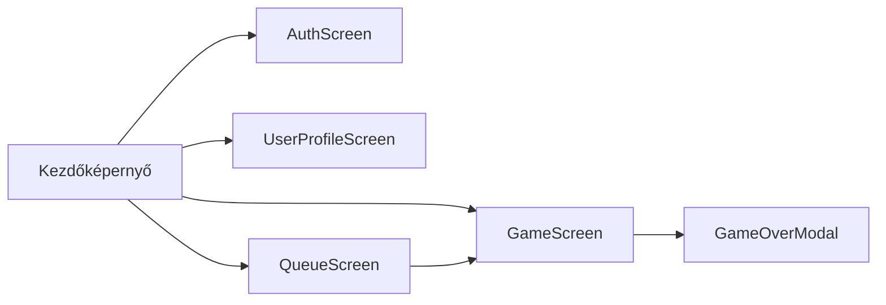

# Funkcionális specifikáció
## A rendszer célja
- Az eredeti Infinity-Simon játék továbbfejlesztése egy többjátékos, versengő játékmóddal.
- A játékosok pontszámainak szerveren történő tárolása és elérhetősége bármilyen eszközről.
- Részletes statisztikák és elemzések biztosítása a játékosok teljesítményéről.
- Különböző játékmódok bevezetése a változatos játékélmény érdekében.
- Jelenlegi egyjátékos mód megtartása.

**A rendszernek nem célja**:
- Közösségi funkciók, mint például chat vagy barátlista.
- Hirdetések vagy fizetős tartalmak bevezetése.
- Többplatformos támogatás, a rendszer kizárólag webes környezetben működik.

## Használati esetek
#todo

## Használati esetek
#todo

## Határ osztályok
| Határ osztály | Leírás |
|---------------|--------|
| App | A fő alkalmazás osztály, amely kezeli a képernyők közötti navigációt. |
| AuthScreen | A felhasználói bejelentkezést és regisztrációt kezeli. |
| UserContext | A felhasználói állapot és adatok kezeléséért felelős osztály. |
| MainScreen | A kezdőképernyő, ahol a játékos navigálhat a különböző funkciók között. |
| QueueScreen | A többjátékos játékokhoz való csatlakozást és várakozást kezeli. |
| UserProfileScreen | A felhasználói profil megtekintését és szerkesztését teszi lehetővé valamit a felhasználói statisztikák megjelenítését. |
| GameScreen | A játék fő képernyője, ahol a játékos játszik |
| GameOverModal | A játék vége képernyő, ahol a játékos megtekintheti az eredményét és a pontszáma elmentésre kerül. |

## Menü hierarchia

## Képernyő tervek

> **Figyelem:** A képernyőtervek előzetes vázlatok, amelyek a fejlesztés során változhatnak. A végleges felhasználói felület eltérhet az itt bemutatott vázlatoktól.

#todo