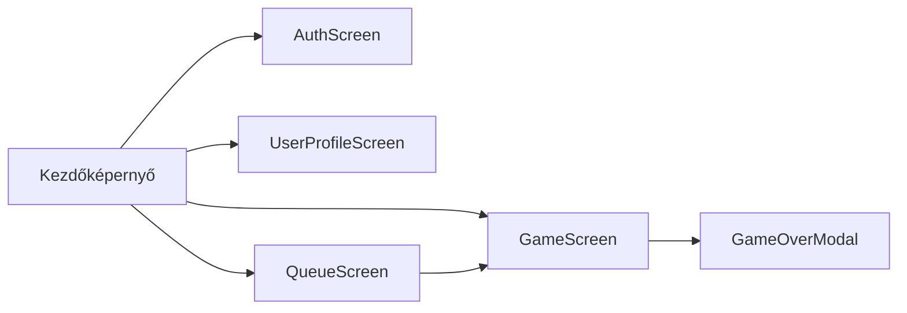

# Funkcionális specifikáció
## A rendszer célja
- Az eredeti Infinity-Simon játék továbbfejlesztése egy többjátékos, versengő játékmóddal.
- A játékosok pontszámainak szerveren történő tárolása és elérhetősége bármilyen eszközről.
- Részletes statisztikák és elemzések biztosítása a játékosok teljesítményéről.
- Különböző játékmódok bevezetése a változatos játékélmény érdekében.
- Jelenlegi egyjátékos mód megtartása.

**A rendszernek nem célja**:
- Közösségi funkciók, mint például chat vagy barátlista.
- Hirdetések vagy fizetős tartalmak bevezetése.
- Többplatformos támogatás, a rendszer kizárólag webes környezetben működik.

## Használati esetek

### 1. Egyjátékos mód
**Cél:** Memóriajáték kipróbálása és saját rekord megdöntése  
**Leírás:**  
Simonfi Sándor felkeresi az Infinite-Simon weboldalt, hogy tesztelje a memóriáját. Bejelentkezés után elindítja az egyjátékos módot. A játék az első körökben egyszerűbb mintákat mutat, amelyeket Sándor könnyedén követ. Az 5. kör után a játék nehézségi szintje növekszik, új minták és kihívások jelennek meg. A 7. körben Sándor hibázik és véget ér a játék. A rendszer elmenti az eredményt, és Sándor látja, hogy új személyes rekordot ért el. Motiváltan zárja be az alkalmazást, elhatározva, hogy legközelebb még jobb eredményt fog elérni.

### 2. Többjátékos mód
**Cél:** Más játékosok elleni verseny  
**Leírás:**  
Simonfi Sándor a főmenüből kiválasztja a többjátékos módot, ahol a rendszer automatikusan hasonló képességű ellenfeleket keres. Csatlakozás után a játékosok felváltva követik a mintákat, és a rendszer valós időben mutatja az aktuális állást. Aki tovább bírja hibázás nélkül, az nyer. A játék végén a pontszámok frissülnek, és a felhasználó láthatja helyezését a ranglistán.

### 3. Statisztikák megtekintése
**Cél:** Saját teljesítmény elemzése  
**Leírás:**  
Simonfi Sándor a profil oldalára navigál, ahol részletes statisztikákat talál az eddigi játékairól. Megtekintheti átlagos körszámait, legjobb eredményeit különböző játékmódokban, valamint fejlődési grafikonját az idő függvényében.

## Határ osztályok
| Határ osztály | Leírás |
|---------------|--------|
| App | A fő alkalmazás osztály, amely kezeli a képernyők közötti navigációt. |
| AuthScreen | A felhasználói bejelentkezést és regisztrációt kezeli. |
| UserContext | A felhasználói állapot és adatok kezeléséért felelős osztály. |
| MainScreen | A kezdőképernyő, ahol a játékos navigálhat a különböző funkciók között. |
| QueueScreen | A többjátékos játékokhoz való csatlakozást és várakozást kezeli. |
| UserProfileScreen | A felhasználói profil megtekintését és szerkesztését teszi lehetővé valamit a felhasználói statisztikák megjelenítését. |
| GameScreen | A játék fő képernyője, ahol a játékos játszik |
| GameOverModal | A játék vége képernyő, ahol a játékos megtekintheti az eredményét és a pontszáma elmentésre kerül. |

## Menü hierarchia

## Képernyő tervek

> **Figyelem:** A képernyőtervek előzetes vázlatok, amelyek a fejlesztés során változhatnak. A végleges felhasználói felület eltérhet az itt bemutatott vázlatoktól.

### Nem regisztrált felhasználó

### Regisztrált felhasználó

### Felhasználói profil és statisztikák

### Játék képernyő (alap simon vagy kibővített játékmód eleje)

### Játék képernyő (kibővített játékmód közben)

### Játék vége képernyő
