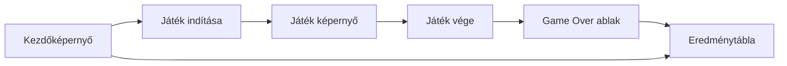

# Funkcionális specifikáció
## A rendszer célja
- Memória fejlődést elősegítő játékos felület weboldalon való megvalósítása
- Rekord értékek segítségével a gyakorlottság és emlékezőképesség fejlődésének követése
- Versenyszerű kézségösszemérés egyéb játékosokkal

**A rendszernek nem célja**:
- Regisztráció vagy felhasználói fiók létrehozása
- Pontszámok felhőben való tárolása
- Többjátékos mód
- Közösségi funkciók (pl. barátok hozzáadása, üzenetküldés)

## Használati esetek
- **Játék indítása**: A látogató elindítja a játékot, ekkor a rendszer generál egy input-kombinációt, amit a játékosnak meg kell jegyeznie.
- **Játék menete**: A játékos megpróbálja megismételni az input-kombinációt. Ha sikerül, a rendszer újabb inputot ad a kombinációhoz, növeli a pontszámot, és a játék folytatódik. Ha nem sikerül, a játék véget ér, és a játékos pontszáma rögzítésre kerülhet.
- **Eredménytábla megtekintése**: A látogatók és játékosok megtekinthetik az eredménytáblát, ahol a legjobb pontszámokat látják az adott számitógépen.

## Használati esetek
**User Story:**

Simonfi Sándor egy napon úgy döntött, hogy "Simon Says" játékkal akar játszani.

Ezért fellép a Infinit-Simon weboldalra, hogy tesztelje a memóriáját. Miután játszik 5 kört, örömmel látja hogy a játék nem az eredeti sima "Simon Says" játékot folytatja hanem új lehetőségek nyilnak meg előtte.

Sajnos erre nem volt felkészülve és a 7 körben veszít, de ez több erőt ad neki hogy később megdöntse a saját rekordját.

Simonfi Sándor kilép.
| Használati eset | Leírás |
|-----------------|--------|
| Játék indítása | A látogató elindítja a játékot, ekkor a rendszer generál egy input-kombinációt, amit a játékosnak meg kell jegyeznie. |
| Játék menete | A játékos megpróbálja megismételni az input-kombinációt. Ha sikerül, a rendszer újabb inputot ad a kombinációhoz, növeli a pontszámot, és a játék folytatódik. Ha nem sikerül, a játék véget ér, és a játékos pontszáma rögzítésre kerülhet. |
| Eredménytábla megtekintése | A látogatók és játékosok megtekinthetik az eredménytáblát, ahol a legjobb pontszámokat látják az adott számitógépen. |

## Határ osztályok
| Határ osztály | Leírás |
|---------------|--------|
| App | A fő alkalmazás osztály, amely kezeli a képernyők közötti navigációt. |
| WelcomeScreen | A játék indítására és az eredménytábla megtekintésére szolgál. |
| GameScreen | A játékos interakcióját kezeli, bemenetet fogad és visszajelzést ad. |
| GameOverModal | A játék végét jelző ablak, amely megjeleníti a pontszámot és lehetőséget ad a pontszám mentésére. |
| ScoreboardScreen | A legjobb pontszámokat jeleníti meg. |

## Menü hierarchia

## Képernyő tervek

> **Figyelem:** A képernyőtervek előzetes vázlatok, amelyek a fejlesztés során változhatnak. A végleges felhasználói felület eltérhet az itt bemutatott vázlatoktól.

