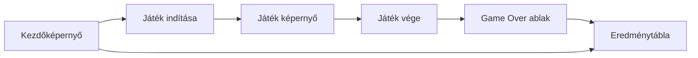
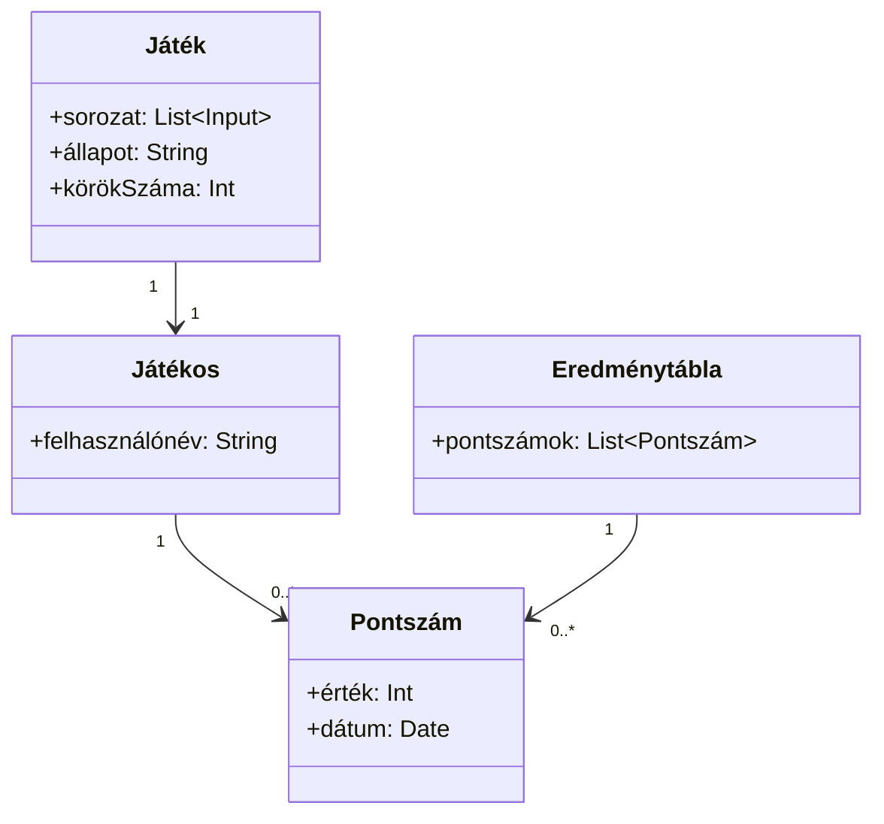
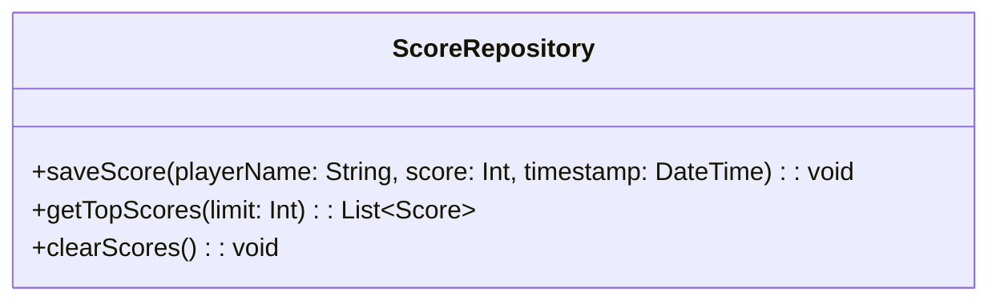
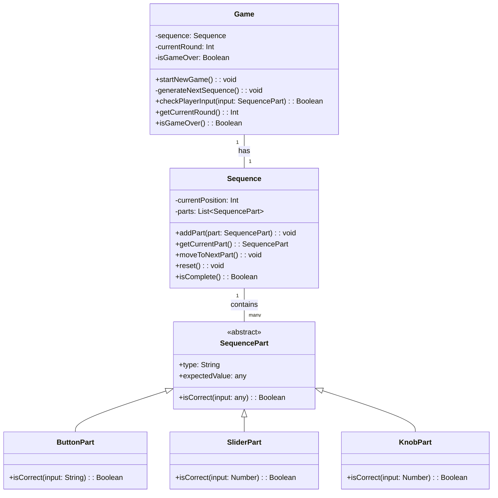
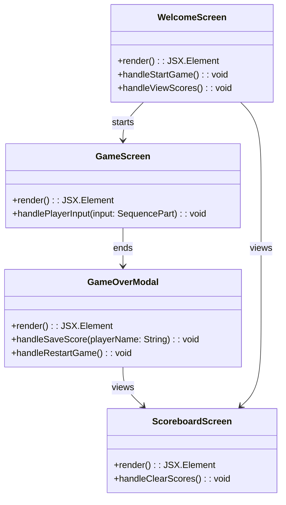

# Rendszerterv
## A rendszer célja
- Memória fejlődést elősegítő játékos felület weboldalon való megvalósítása
- Rekord értékek segítségével a gyakorlottság és emlékezőképesség fejlődésének követése
- Versenyszerű kézségösszemérés egyéb játékosokkal
## Projekt terv
- Rendszer terv megírása 09.21.
- További követelmények megismerése 09.22.
- Újonnan felmerült követelmények kivitelezésének megvitatása 09.22
- Újonnan felmerült követelmények teljesítése 09.22-29
- Webfelület létrehozása 09.27-ig
- Webfelület interaktívvá tétele 09.28-ig
- "Alap Simon says" megvalósítása 09.29-ig
- Fejlesztés közben felmerült hibák jegyzetelése 09.29-ig
- Fejlesztés közben felmerült követelmények jegyzetelése 09.29-ig
- Fejlesztés közben felmerült design "nice to have" elemek jegyzetelése 09.29.-ig
- További követelmény megismerése 09.30.
- Kritikus hibák kijavítása 09.31.
- Kissebb fontosságú hibák javítása 10.01.
- Újonnani követelmények implementálása 10.03-ig
- Design finomítása 10.03-ig
- Tesztelés minimális implementálása 10.04.
- Tesztelés során felmerült problémák jegyzetelése 10.04.
- Tesztelés folytatása és hibák javítása 10.05-ig
- Értékelésre alkalmas állapotról való meggyőződés 10.05.
## Üzleti folyamatok modellje
[](https://editor.plantuml.com/uml/TLBDIiD04BxlKmovrmUG4WeYWYWAXTwdoJHTijajkzD08Zv4xbvwpC6Ju0iiVIytcneZw6LWvflPxuTTEKRBnqe9HJi6Dc1biMV8fQMCfT42CpOMaWT_ObCW-uy4qC56EXdct-XzG7rV6XV1Ewp82d70hCI28F5lUUq_MtNkeFJzWQnkpbq2BmBWw2X3HzCB87NktzcV7CQdreEy-TwjfRpolMx2pbOXL5GmbLA7OqVZIMOiRGtQNBpEH5m8_g7T6TLWXJooFYjivbjhOotf74WfqkVEjXFPpPwoShww8TSEMgOWdkgGnLy6u97cgh6cg7mGVKaN5elqai2loO_12CRXc7ciiOyMXXAxKMQiS9LEkk0QbiizgOOf64jJ8IOa4asQLi7zy4c-0000)

### Szereplők
- **Látogató**: aki csak belép az oldalra, és megnézheti az eredménytáblát.
- **Játékos**: aki ténylegesen elindítja a játékot, interakcióba lép vele, pontot szerez.

### Folyamatok
- **Játék indítása**: A látogató elindítja a játékot, ekkor a rendszer generál egy input-kombinációt, amit a játékosnak meg kell jegyeznie.
- **Játék menete**: A játékos megpróbálja megismételni az input-kombinációt. Ha sikerül, a rendszer újabb inputot ad a kombinációhoz, növeli a pontszámot, és a játék folytatódik. Ha nem sikerül, a játék véget ér, és a játékos pontszáma rögzítésre kerülhet.
- **Eredménytábla megtekintése**: A látogatók és játékosok megtekinthetik az eredménytáblát, ahol a legjobb pontszámokat látják az adott számitógépen.

### Entitások
- **Játék**: Aktuális input-sorozat, játék állapota (aktív vagy véget ért), körök száma.
- **Játékos**: Felhasználónév.
- **Pontszám**: Játékoshoz kötött pontszám, elért körök száma, dátum.
- **Eredménytábla**: Legjobb pontszámok listája, játékosok nevei és elért körök száma.

## Követelmények

### Funkcionális követelmények
- A látogató képes legyen elindítani a játékot a kezdőképernyőről.
- A látogató képes legyen megtekinteni az eredménytáblát.
- A rendszer jelenítse meg a sorozatot a játékos számára minden körben.
- A rendszer véletlenszerűen generálja a sorozatot külön játék menetek között.
- A rendszer ellenőrizze a játékos bemenetét és adjon visszajelzést.
- A rendszer folytassa a játékot helyes bemenet után, növelve a sorozat hosszát és nehézségét.
- A rendszer végezze el a játék lezárását, ha a játékos hibázik.
- A rendszer mentse a játékos pontszámát.
- Az eredménytábla mindig a legjobb pontszámokat mutassa, rendezve.

### Nem funkcionális követelmények
- A felület legyen mobilon és desktopon is jól használható.
- A rendszer ne igényeljen regisztrációt a játékhoz.
- A felhasználói pontszámok csak a böngészőben tárolódjanak.
- A rendszer böngészőfüggetlenül működjön.
- A rendszer adjon lehetőséget a pontszám mentés kihagyására amennyiben a felhasználó nem igényli.
- A pontszámokat ne lehessen véglegesen módosítani a játékmenet szakszerű használata nélkül.

## Funkcionális terv
### Rendszer szereplők
[Több információ](#szereplők)

### Használati esetek
[Több információ](#folyamatok)

[User Story](user-story1.md)

### Határ osztályok
| Határ osztály | Leírás |
|---------------|--------|
| App | A fő alkalmazás osztály, amely kezeli a képernyők közötti navigációt. |
| WelcomeScreen | A játék indítására és az eredménytábla megtekintésére szolgál. |
| GameScreen | A játékos interakcióját kezeli, bemenetet fogad és visszajelzést ad. |
| GameOverModal | A játék végét jelző ablak, amely megjeleníti a pontszámot és lehetőséget ad a pontszám mentésére. |
| ScoreboardScreen | A legjobb pontszámokat jeleníti meg. |

### Menü hierarchia


### Képernyő tervek

> **Figyelem:** A képernyőtervek előzetes vázlatok, amelyek a fejlesztés során változhatnak. A végleges felhasználói felület eltérhet az itt bemutatott vázlatoktól.


## Fizikai környezet

## Absztrakt domain modell

## Architektúra terv

## Adatbázis terv
Az adatok JSON formátumban kerülnek mentésre egy fix kulcs alatt `scores`. A tárolt adatok struktúrája a következő:
```json
{
  "scores": [
    {
      "player": "Anna",
      "score": 12,
      "date": "2025-09-21T14:32:00Z"
    },
    {
      "player": "Béla",
      "score": 9,
      "date": "2025-09-21T14:40:00Z"
    }
  ]
}
```
## Implementációs terv
### Perszistencia réteg
- A játékos pontszámait a böngésző `localStorage`-jában tároljuk.
- Az adatok JSON formátumban kerülnek mentésre.
- Az adatok betöltése a játék indításakor történik, és a pontszám mentése a játék végén.

- A `ScoreRepository` egy wrapper osztály, amely a `localStorage`-t kezeli, mentést és betöltést végez.

### Üzleti logika réteg
- A játék logikáját a `Game` osztály kezeli.
- A `Game` osztály felelős a játék állapotának kezeléséért, a bemenet ellenőrzéséért és a pontszám számításáért.

- A `Game` osztály kezeli a játék állapotát, generálja a bemeneti sorozatot, ellenőrzi a játékos bemenetét, és nyomon követi a körök számát.
- A `SequencePart` osztály reprezentálja a bemeneti elemeket, amelyek lehetnek gombok, csúszkák, tekerők vagy egyéb interaktív elemek.

### Prezentációs réteg
- A felhasználói felület React komponensekből áll.
- Minden képernyő egy külön komponens, amely a megfelelő üzleti logikát és perszisztencia réteget használja.


## Tesztterv
### 1. Egységtesztek
- **Game osztály**:  
  - `checkPlayerInput()` helyes és helytelen bemenetekre.
  - `generateNextSequence()` sorozatnövelés ellenőrzése.
  - Játék állapotának (`isGameOver`) helyes kezelése.
- **ScoreRepository**:
  - Pontszám mentése és betöltése `localStorage`-ból.
  - Legjobb pontszámok lekérése (`getTopScores(limit)`).
  - Pontszámok törlése (`clearScores()`).

### 2. Felhasználói tesztek
- Játék indítása és sorozatok megjelenítése.
- Játékos bemenet ellenőrzése, helyes és helytelen válasz esetén visszajelzés.
- Eredménytábla megjelenítése és pontszámok helyes rendezése.
- Pontszám mentése és böngésző újratöltés után történő betöltése.
- Játék kései állapotának tesztelése

### 3. Nem funkcionális tesztek
- Reszponzív design ellenőrzése mobil és desktop eszközökön.
- Böngészőfüggetlenség tesztelése Chrome, Firefox, Edge böngészőkben.
- Teljesítményteszt: rövid késleltetés a sorozat megjelenítésekor.
- Játékos sebesség teszt: a bemenet sorrendjének pontossága még akkor is ha a felhasználó gyorsan üti be őket.

## Telepítési terv

## Karbantartási terv
