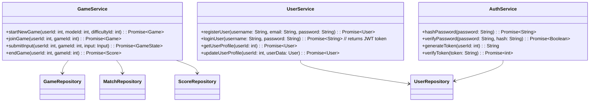

# Rendszerterv
## Projekt terv
#todo

### Csapatbeosztás
- Tervező: Pataki Dávid (közös)
- Designer: Pataki Dávid
- Implementáció
    - Frontend: Pataki Dávid
    - Backend
        - Adatbázis: Kerekes Bence
        - Játék Logika: Kerekes Bence
        - Websocket: #TODO
        - API: Csendes Dávid

- Tesztelő: #TODO

## Üzleti folyamatok modellje
[](https://editor.plantuml.com/uml/ZLJ1Rjim3BqRy3yGkUoKeNBQBXsAeCNG0XiQO5ZNtbM7SJJBaY4f1wVOH-mJSkmvm7v0s7zDikKuAheX5vlaUwGUATfNsb1brXLF4uvB0qQ2OiNAm88fp0sJ8atIXEP6AhYpMoCBQkmEg0RUXs-HhwZU2Blb7LBto1UNO5zAgTiewSDpkzLxI9OjcFbZQfgNj40OVHPB9fXfxbabnGYUqmHWhJ6dse7NQuF2iD9kSsPt8v_-y8b4b9kY-R4_UsvtYy3A8jPt-_lfwKtU9E9zLNB9EConC5WouUWQ0_4q8iunppMKg50xJg2SfSdFgBdusDVTXS70KlA6LjJGKEOyOjrBfL0i03b7yUUNsXne-X0n7r5lpA1c6iz9uQAoBwA12gE-BbwBFfpeiPB9oT6Q2VcVQ98TfvfCWkntC1wFuTflc_QcMsxtcdKRq9kaRN1mwe7IcvF1FFLi1xQktsLtitkx9e5rVc3xzkji05ovu9mDsItI2_w6dFfFJhjHAgZMtB2QqmPLruFZmljPTyFkqTbJ-0YNbolaZK4trzdCOzCEk_XNQSr4mJ6kJKww9DBsHaZmihVgksY7JY1DhjobjZ-Glm00)
### Szereplők
- **Látogató**: aki csak belép az oldalra, nincs regisztrálva, de képes egyjátékos módban játszani.
- **Felhasználó**: aki regisztrált és bejelentkezett, játszhat a többjátékos módban, és megnézheti a saját statisztikáit.
- **Játékos**: aki játszik a játékkal, lehet látogató vagy felhasználó is.
- **Más Játékosok**: felhasználón kívüli más Játékosok akik a többjátékos módban részt vesznek.

### Entitások
- **Játékos**: felhasználónév, email, jelszó (hash-elve), avatar URI, regisztráció dátuma, utolsó bejelentkezés dátuma.
- **Játék**: sorozat (lista a bemenetekről), állapot (folyamatban, befejezett), mód (egyjátékos, többjátékos), nehézség (eredeti, kibővített), körök száma.
- **Pontszám**: pontszám érték, dátum.

## Követelmények

### Funkcionális követelmények
- A látogató képes legyen regisztrálni és bejelentkezni.
- A látogató képes legyen elindítani egy egyjátékos játékot a kezdőképernyőről.
- A felhasználó képes legyen elindítani egy új játékot (egy- vagy többjátékos mód).
- A felhasználó képes legyen csatlakozni egy többjátékos játékhoz.
- A rendszer kezelje a többjátékos játékok létrehozását és csatlakozását.
- A rendszer kezelje a játék állapotát és a játékosok bemenetét valós időben.
- A rendszer jelenítse meg a sorozatot a játékos számára minden körben.
- A rendszer véletlenszerűen generálja a sorozatot külön játék menetek között.
- A rendszer ellenőrizze a játékos bemenetét és adjon visszajelzést.
- A rendszer folytassa a játékot helyes bemenet után, növelve a sorozat hosszát és nehézségét.
- A rendszer végezze el a játék lezárását, ha a játékos hibázik vagy túl sokáig gondolkodik.
- A rendszer mentse a játékos pontszámát.

### Nem funkcionális követelmények
- A felület legyen mobilon és desktopon is jól használható.
- A rendszer böngészőfüggetlenül működjön.
- A rendszer legyen skálázható, hogy több játékost is kiszolgáljon egyszerre.
- A rendszer legyen biztonságos, különösen a felhasználói adatok és jelszavak kezelése során.
- A rendszer legyen megbízható, minimalizálva a leállások és hibák előfordulását.
- A rendszer legyen könnyen karbantartható és bővíthető a jövőbeni funkciók hozzáadásához.
- A rendszer legyen gyors, minimalizálva a késleltetést a játékos bemenet és a rendszer válasza között.

## Fizikai környezet
- A rendszer webes környezetben fusson, elérhető legyen modern böngészőkben (Chrome, Firefox, Edge).
- A rendszer frontendje React alapú legyen.
- A rendszer backendje #todo alapú legyen, #todo keretrendszerrel.
- Az adatbázis #todo legyen.
- A valós idejű kommunikáció WebSocket-en keresztül történjen.

## Absztrakt domain modell

## Architektúra terv
### Átfogó architektúra
- A rendszer kliens-szerver architektúrára épül, Frontend és Backend részekre bontva.
- A kommunikáció REST API és WebSocket kapcsolatokon keresztül zajlik.

### Frontend architektúra
- A prezentációs réteg React komponensekből áll, amelyek a felhasználói interakciókat kezelik.
- A felhasználói interakciók eseményeket generálnak, amelyek HTTP kéréseket vagy WebSocket üzeneteket küldenek a szervernek.

### Backend architektúra
- Az üzleti logika réteg a játék szabályait és állapotát kezeli.
- A valós idejű kommunikáció WebSocket-en keresztül történik (játék logika, többjátékos funkciók).
- A REST API felelős a felhasználókezelésért, játékok listázásáért és nem valós idejű műveletekért.
- A perszisztencia réteg a felhasználói adatok és pontszámok tárolásáért felelős adatbázisban.

### Kommunikációs folyamatok
- REST API: Regisztráció, bejelentkezés, játéklista lekérdezés, játék létrehozás, pontszámok lekérdezése
- WebSocket: Valós idejű játékmenet, játékosok csatlakozása, játékállapot szinkronizáció, játékbemenetek továbbítása

## Adatbázis terv
- Az adatbázis a felhasználói adatok, játékok és pontszámok tárolására szolgál.
- Valós idejű játékmenet adatai nem kerülnek tárolásra, csak a végleges pontszámok.
- Az adatbázis relációs adatbázis, amely a következő táblákat tartalmazza:
    - Felhasználók (Users)
    - Játékok (Games)
    - Játékmódok (Modes)
    - Nehézségi szintek (Difficulties)
    - Játék menetek (Matches)
    - Résztvevők (Participants)
- A táblák közötti kapcsolatok:
    - Egy játékban több résztvevő is lehet (többjátékos esetén).
    - Egy játékmód több játékhoz is tartozhat.
    - Egy nehézségi szint több játékhoz is tartozhat.
    - Egy játék több játékmenetet is tartalmazhat.
    - Egy játékmenet több résztvevőt is tartalmazhat (több játékos esetén).

## Implementációs terv
### Perszistencia réteg
+ A perszisztencia réteg #todo adatbázisra épül.
+ Az adatbázis kapcsolódást #todo biztosítja.
+ Az adatok lekérdezése és mentése aszinkron módon történik.

+ A UserRepository a felhasználói adatok kezeléséért felelős.
+ A GameRepository a játékmódok és beállítások tárolását végzi.
+ A MatchRepository a játék meneteket kezeli.
+ A ScoreRepository a pontszámok mentését és lekérdezését valósítja meg.

### Üzleti logika réteg
+ Az üzleti logika réteg a játék szabályait és állapotát kezeli.
+ A játék menetek létrehozása, kezelése és lezárása itt történik.
+ A játékosok bemenetének ellenőrzése és a pontszámok számítása is ebben a rétegben valósul meg.

+ A GameService kezeli a játék menetek létrehozását, csatlakozását, bemenetek feldolgozását és a játék lezárását.
+ A UserService a felhasználói regisztrációt, bejelentkezést és profilkezelést végzi.
+ Az AuthService a jelszavak hash-eléséért, ellenőrzéséért és a JWT tokenek kezeléséért felelős.
+ Minden szolgáltatás a megfelelő repository-kat használja az adatok kezelésére.    

### Prezentációs réteg
+ A prezentációs réteg a felhasználói interakciókat kezeli.
+ A REST API végpontok itt kerülnek definiálásra.
+ A WebSocket szerver a valós idejű játékmenetet kezeli

+ Az ApiController kezeli a REST API végpontokat, és a megfelelő szolgáltatásokat hívja meg.
+ A WebSocketServer kezeli a WebSocket kapcsolatokat, fogadja az üzeneteket, és továbbítja a játék állapotát a játékosoknak.
+ Mindkét komponens a megfelelő szolgáltatásokat használja az üzleti logika végrehajtásához.    

## Tesztterv
### 1. Egységtesztek
+ Minden szolgáltatás és repository osztályhoz tartozó egységtesztek írása.
+ A tesztek ellenőrzik a metódusok helyes működését, beleértve a bemenetek és kimenetek helyességét.
+ Frontend komponensek tesztelése a megfelelő viselkedés és állapotváltozások ellenőrzésére.

### 2. Felhasználói tesztek
- Játék indítása és sorozatok megjelenítése.
- Játékos bemenet ellenőrzése, helyes és helytelen válasz esetén visszajelzés.
- Eredménytábla megjelenítése és pontszámok helyes rendezése.
- Pontszám mentése és böngésző újratöltés után történő betöltése.
- Játék kései állapotának tesztelése

### 3. Nem funkcionális tesztek
- Reszponzív design ellenőrzése mobil és desktop eszközökön.
- Böngészőfüggetlenség tesztelése Chrome, Firefox, Edge böngészőkben.
- Teljesítményteszt: rövid késleltetés a sorozat megjelenítésekor.
- Játékos sebesség teszt: a bemenet sorrendjének pontossága még akkor is ha a felhasználó gyorsan üti be őket.

## Telepítési terv
#todo

## Karbantartási terv
#todo
